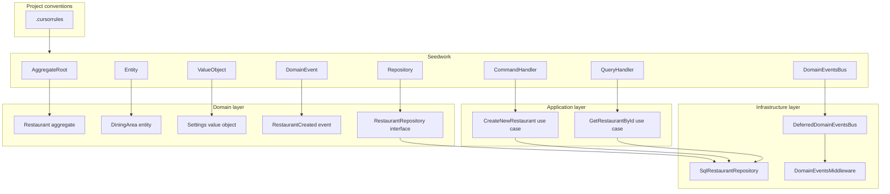

# PHP Seedwork

DDD and Hexagonal Architecture building blocks (aggregates, entities, value
objects, command/query handlers, etc).

## Goal

- **Unify patterns:** All domain and application code extends or implements
 Seedwork abstractions, keeping the codebase consistent and predictable.
- **Keep the domain pure:** Domain types depend only on Seedwork domain types;
 no framework or infrastructure in the domain layer.
- **Clear boundaries:** Application use cases are expressed as command handlers
 (writes) and query handlers (reads), with primitives-only DTOs at the port boundary.

See the [docs](docs/) for architecture and usage details.

## Architecture role

Seedwork sits between project conventions and application/domain code:



- **Domain layer:** Extends Seedwork domain bases (`AggregateRoot`, `Entity`,
 `ValueObject`), uses `EntityId`, raises `DomainEvent` and `DomainException`/
 `ValueException`, and defines repository interfaces extending `Repository<T>`.
- **Application layer:** Use case interfaces extend `CommandHandler<TCommand>`
 or `QueryHandler<TQuery, TResult>` and declare `execute()`. Handlers implement
  those interfaces and depend on domain repository interfaces.
- **Infrastructure layer:** Implements `Repository<T>` and optionally
 `DomainEventsBus` (e.g. `DeferredDomainEventsBus`). Controllers dispatch to use
  cases; middleware or similar calls `DomainEventsBus::notify()` after handling
   a request.

## Requirements

- PHP 8.4 or later

## Installation

From [Packagist](https://packagist.org) (when published):

```bash
composer require aseguragonzalez/seedwork
```

From this repository (or from a monorepo, use the path to the package, e.g. `./packages/seedwork`):

Add to your root `composer.json`:

```json
{
    "repositories": [
        { "type": "path", "url": "." }
    ],
    "require": {
        "aseguragonzalez/seedwork": "@dev"
    }
}
```

Then run `composer update aseguragonzalez/seedwork`.

## Getting started

After installation, the library is available under the `Seedwork\` namespace.
Start with the [domain basics](docs/seedwork/01-domain.md) and
[application layer](docs/seedwork/04-application.md). For full usage, examples,
and component reference, see the [Seedwork architecture and usage guide](docs/seedwork/README.md).
Run `make test` from the package directory to verify the setup.

## Built with

- **PHP** 8.4
- **Composer** for dependency management
- **PHPUnit** for tests
- **PHPStan** for static analysis
- **PHP-CS-Fixer** for code style (PSR-12)
- **PHP_CodeSniffer** for linting (PSR-12)

## Documentation

See the [docs](docs/) folder or
[resbooking-seedwork docs](https://github.com/aseguragonzalez/resbooking-seedwork/tree/main/docs)
for architecture and usage. [docs/seedwork/README.md](docs/seedwork/README.md)
 contains the PHP Seedwork
architecture, usage by layer, concrete examples, and the component reference table.

## Development

From the package directory:

```bash
make install
make all
```

- `make test` — run PHPUnit
- `make format` — fix code style with PHP-CS-Fixer
- `make format-check` — check style without changing files
- `make lint` — run PHP_CodeSniffer (PSR-12)
- `make static-analyse` — run PHPStan
- `make clean` — remove vendor, coverage, caches
- `make create-package` — build a zip archive in `dist/`

## Releasing

1. Edit `VERSION` in this directory with the new semantic version
   (e.g. `0.0.2`, `0.2.0-alpha`).
2. Commit and push to `main`, or merge a pull request.
3. The release workflow runs automatically. If the tag `seedwork-v{VERSION}`
   does not exist, it validates, builds, and publishes a GitHub Release with
   the zip artifact.
4. No manual `git tag` or `git push --tags` is required.

## License

[MIT License](LICENSE). Copyright (c) 2026 Alfonso Segura.
