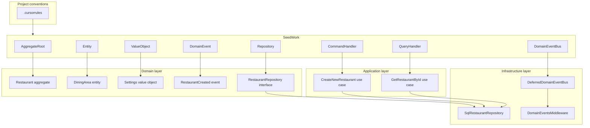

# PHP SeedWork

DDD and Hexagonal Architecture building blocks (aggregates, entities, value
objects, command/query handlers, etc).

## Goal

- **Unify patterns:** All domain and application code extends or implements
  SeedWork abstractions, keeping the codebase consistent and predictable.
- **Keep the domain pure:** Domain types depend only on SeedWork domain types;
  no framework or infrastructure in the domain layer.
- **Clear boundaries:** Application use cases are expressed as command handlers
  (writes) and query handlers (reads), with primitives-only DTOs at the port
  boundary.

See the [docs](docs/) for architecture and usage details.

## Architecture role

SeedWork sits between project conventions and application/domain code:



- **Domain layer:** Extends SeedWork domain bases (`AggregateRoot`, `Entity`,
  `ValueObject`), uses `EntityId`, raises `DomainEvent` and `DomainException`/
  `ValueException`, and defines repository interfaces extending `Repository<T>`.
- **Application layer:** Use case interfaces extend `CommandHandler<TCommand>`
  or `QueryHandler<TQuery, TResult>` and implement `handle()`. Handlers
  implement those interfaces and depend on domain repository interfaces.
- **Infrastructure layer:** Implements `Repository<T>` and optionally
  `DomainEventBus` (e.g. `DeferredDomainEventBus`). Controllers dispatch to use
  cases; middleware or similar calls `DomainEventBus::publish()` after handling
  a request.

## Requirements

- PHP 8.4 or later
- Composer 2.x

## Installation

From [Packagist](https://packagist.org) (when published):

```bash
composer require aseguragonzalez/seedwork
```

From this repository (or from a monorepo, use the path to the package, e.g.
`./packages/seedwork`):

Add to your root `composer.json`:

```json
{
    "repositories": [
        { "type": "path", "url": "." }
    ],
    "require": {
        "aseguragonzalez/seedwork": "@dev"
    }
}
```

Then run `composer update aseguragonzalez/seedwork`.

## Getting started

After installation, the library is available under the `SeedWork\` namespace.

- **[Component reference](docs/component-reference.md)** — All interfaces, base
  classes, and infrastructure components.
- **[Coding standards](docs/coding-standards.md)** — Conventions and do/don't
  guidelines.
- **[Best practices](docs/best-practices.md)** — How to use the package in your
  project.
- **[tests/Fixtures/BankAccount/](tests/Fixtures/BankAccount/)** — Full
  working example (domain, application, infrastructure).

Run `make test` from the package directory to verify the setup.

## Built with

- **PHP** 8.4
- **Composer** for dependency management
- **PHPUnit** ^12.5 for tests
- **PHPStan** ^2.1 for static analysis
- **PHP-CS-Fixer** ^3.93 for code style
- **PHP_CodeSniffer** (PSR-12) for linting

## Documentation

Documentation lives in the [docs/](docs/) directory:

- [docs/README.md](docs/README.md) — Index and quick links.
- [Component reference](docs/component-reference.md) — Every SeedWork component.
- [Coding standards](docs/coding-standards.md) — Conventions and do/don't notes.
- [Best practices](docs/best-practices.md) — Usage guide.
- [Examples](docs/examples/) — Copilot instructions and Cursor rules for
  consumer projects.

Source and issue tracker: [resbooking-seedwork](https://github.com/aseguragonzalez/resbooking-seedwork).

## Development

From the package directory:

```bash
make install
make all
```

- `make install` — Install pre-commit hooks and Composer dependencies.
- `make all` — Run format-check, lint, static analysis, and tests.
- `make test` — Run PHPUnit (with coverage in `coverage/`).
- `make format` — Fix code style with PHP-CS-Fixer (PSR-12).
- `make format-check` — Check style without changing files.
- `make lint` — Run PHP_CodeSniffer (PSR-12).
- `make static-analyse` — Run PHPStan (level max).
- `make clean` — Remove vendor, coverage, and caches.
- `make create-package` — Build a zip archive in `dist/`.

## Releasing

1. Edit `VERSION` in this directory with the new semantic version (e.g.
   `0.1.0`, `0.2.0-alpha`).
2. Commit and push to `main`, or merge a pull request.
3. The CD workflow runs on push to `main`. If the tag `seedwork-v{VERSION}` does
   not exist, it runs checks, builds the package, and creates a GitHub Release
   with the zip artifact and tag `seedwork-v{VERSION}`.
4. No manual `git tag` or `git push --tags` is required.

## License

[MIT License](LICENSE). Copyright (c) 2026 Alfonso Segura.
